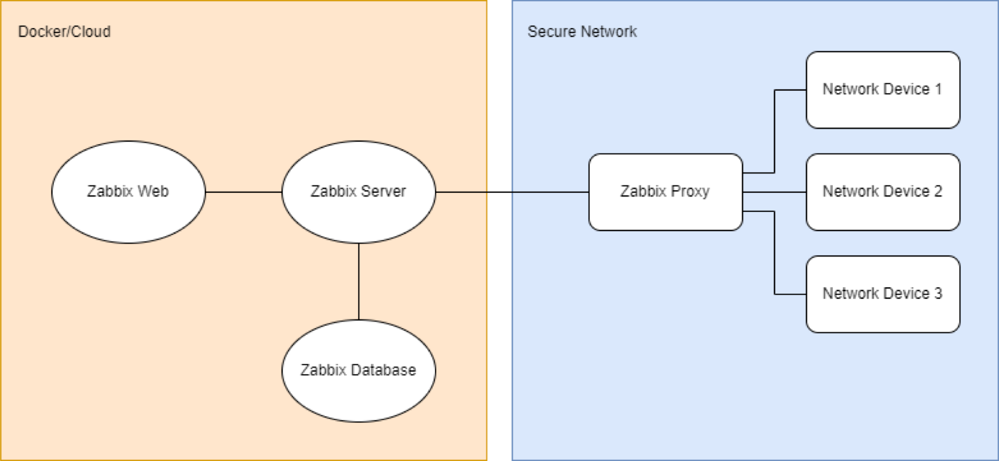

# Technical assessment: Deployment automation of the Zabbix monitoring tool

## Introduction

Since team Aquila's core business is VNFs Monitoring using Zabbix we
would like as part of this technical assessment to simulate just a small
part of our product offering. Imagine you would have to deploy and
configure a basic Zabbix containerized infrastructure in an automated
way applying DevOps practices. On top of that, what would Zabbix be
without nothing to monitor? Therefore, there should also be some
simulated network devices or entities exposing data so that we can say
we have an end‑to‑end Monitoring solution.

## General guidelines

-   Use Zabbix components from official Zabbix containers (on a locally
    set‑up Kubernetes cluster).\
    Hint: https://www.zabbix.com/container_images
-   Simulate network devices using an SNMP Simulator or use Zabbix
    Agents as the monitored entities/target devices.
-   The data monitored by Zabbix for the SNMP simulated devices or
    Zabbix Agents should be related to network interfaces or resources
    (CPU/RAM/Storage, up to you).
-   Configure some Zabbix alerts that should be triggered based on
    thresholds of your choice on the monitored items.
-   Automate your deployment and configuration of the solution using
    Ansible.\
    Hint:
    https://docs.ansible.com/ansible/latest/collections/community/zabbix/index.html
-   Create some documentation for your provided solution (README file).
-   Make use of Git to share the code with us.
-   We would love to have you walking us through your solution during
    the Technical Interview!

## Suggested Deployment Architecture

